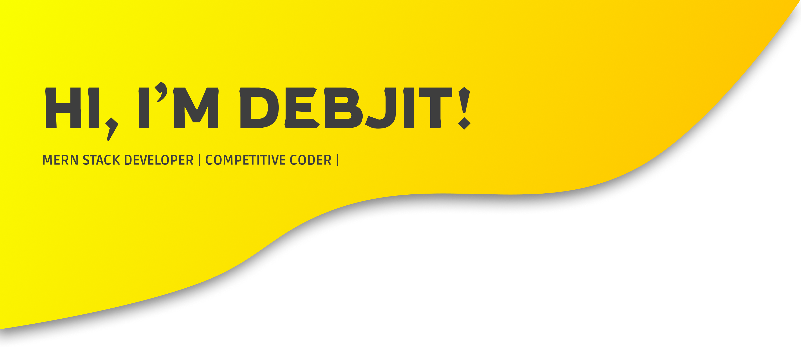

## There are two ways to write error-free programs; only the third one works. 😄😄

### About Me:

	
- 🔭 I’m currently working as an Full Stack Developer Intern
- ✨ I’m currently learning Blockchain
- 🌱 I’m exploring more about Django
- 👯 Interested in Open Source, Cloud Technology and Artificial Intelligence.
- 🤔 Exploring newer technologies and developing useful web apps
- 💼 Fullstack web developer.
- 🎓 Studying Electronics & Communication Engineering.
- ✍️ Love designing UI/UX for applications and creating interesting web apps.

### Let's Connect :coffee:

	
	
	
	
	

 

### Languages and Technologies:

	
 

	
	
	
	
	
	
	
	
	
	
	
	
	
	
	
	
	
	
 

 
 
 
 

 
 

 

